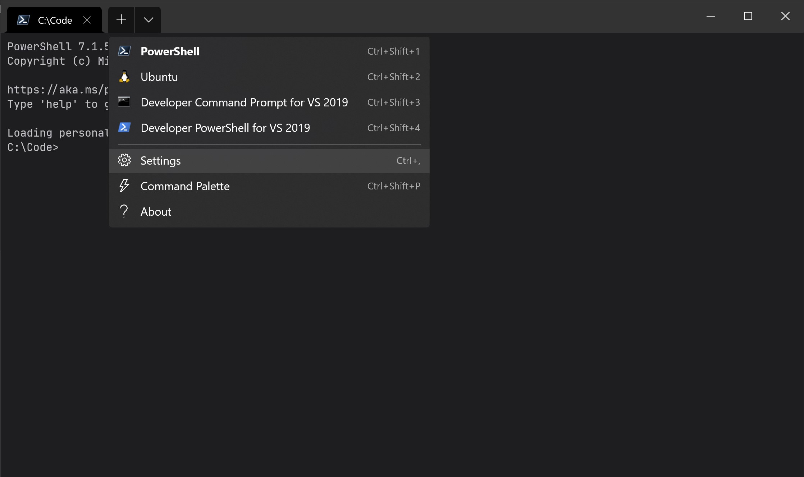
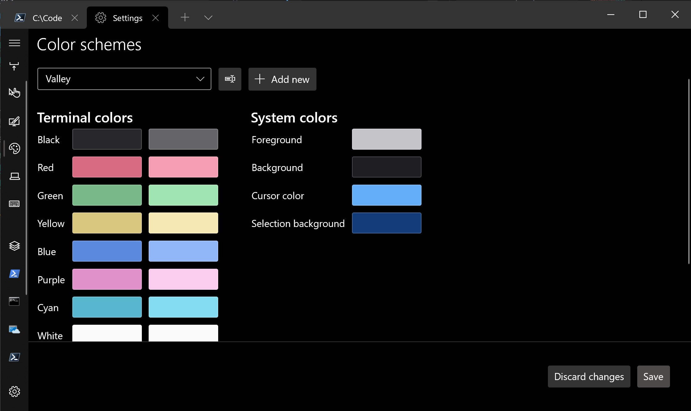

# Valley Theme for Windows Terminal

[Tim Grochowski](https://github.com/TimGr)'s Valley Theme as a Windows Terminal scheme.

---

## Motivation

I've used and enjoyed [Tim Grochowski](https://github.com/TimGr)'s [Valley Theme for Visual Studio Code](https://github.com/TimGr/valley-vscode) for over a year, and wanted to bring its colour palette to my preferred terminal for a more unified development experience.

## Installation

### JSON method

1. Open the Windows Terminal Settings JSON file with `Ctrl + Shift + ,` (default keyboard shortcut at time of writing)
1. Paste the scheme item from this repository into the schemes array
1. In your preferred profile, set `"colorScheme": "Valley",`
1. Save the JSON file, close and re-open Windows Terminal

### Settings UI method

From the "Color schemes" settings page, add a new scheme and copy / paste the hex code for each colour from `settings.json` in this repository.

## Example screenshot PowerShell modules

The example screenshot at the start of this README uses the following PowerShell modules:

- [Get-ChildItemColor](https://github.com/joonro/Get-ChildItemColor)
- [posh-git](https://github.com/dahlbyk/posh-git)
